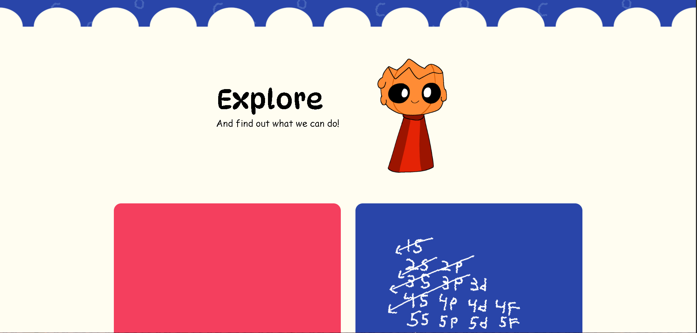
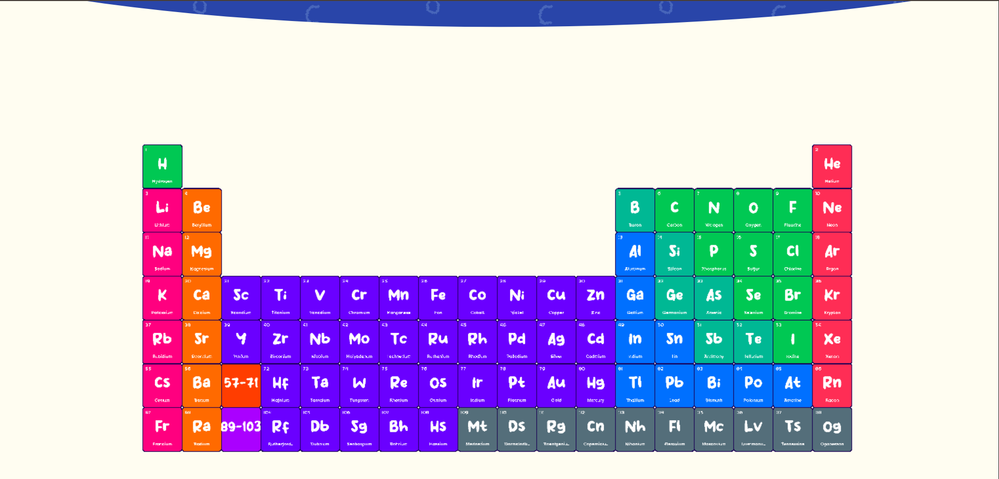
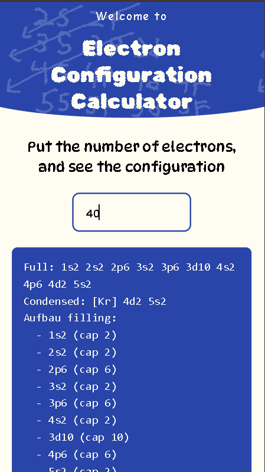
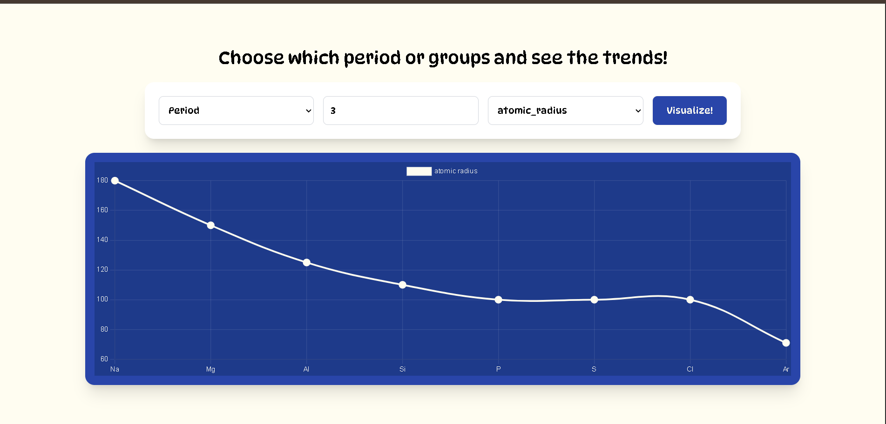
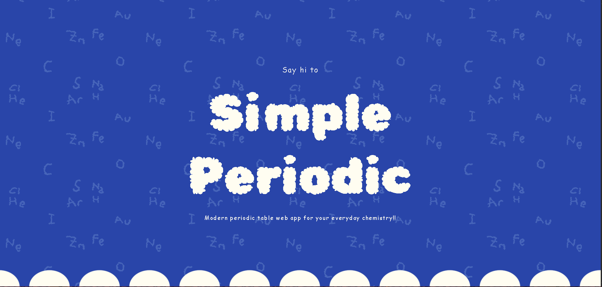

<h1 style="text-align:center">SimplePeriodic</h1>

**SimplePeriodic** is a lightweight chemistry toolkit designed for high school students. It provides essential tools for exploring chemical elements, understanding reactions, and visualizing trends!

---

## Features

* **Periodic Table**
  Browse and explore all chemical elements.

* **Electron Configuration Calculator**
  Generate electron configurations using the Aufbau principle.

* **Reaction Analyzer**
  Balance chemical equations, calculate molar mass, and determine percentage composition.

* **Trends Visualizer**
  Analyze and visualize periodic trends such as:

  * Atomic radius
  * Electronegativity
  * Ionization energy
  * Density
  * Boiling point

---

## Tech Stack

* **Backend:** Flask (Python)
* **Frontend:** Vue.js + Vite
* **Chemistry Libraries:**

  * mendeleev for element data
  * chemlib for reaction analysis
  * Flask for backend
* **WASM Module:** Zig (electron configuration computation)

---

## Installation (Quick Start)

### 1. Clone the repository

```bash
git clone https://github.com/nabeellagi/SimplePeriodic.git
cd SimplePeriodic
```

### 2. Install dependencies

```bash
pip install -r requirements.txt
```

### 3. Run the server

```bash
python app.py
```

---

## Project Structure

```
SimplePeriodic/
│
├── app.py                  # Main Flask application
├── routes/
│   └── api/
│       ├── element.py      # Single element API
│       ├── periodic.py     # All elements API
│       ├── reaction.py     # Reaction analysis API
│       ├── trend.py        # Trends visualization API
│       └── wiki.py         # Wikipedia integration API
│
├── zig/                    # Zig source for WASM electron config
│
├── client/                 # Vue + Vite frontend
│
└── requirements.txt
```

---

## API Documentation

### 1. Element API

* **Endpoint:** `/api/element`
* **Description:** Fetch detailed data for a specific element using the `mendeleev` library.

---

### 2. Periodic Table API

* **Endpoint:** `/api/get-all`
* **Description:** Retrieve data for all elements.

---

### 3. Reaction API

* **Endpoint:** `/api/reaction/`
* **Description:** Analyze chemical reactions using `chemlib`:

  * Balance equations
  * Calculate molar mass
  * Compute percentage composition

---

### 4. Trend API

* **Endpoint:** `/api/trend`
* **Description:** Visualize periodic trends including:

  * Atomic radius
  * Electronegativity
  * Ionization energy
  * Density
  * Boiling point

---

### 5. Wikipedia API

* **Endpoint:** `/api/wiki/`
* **Description:** Fetch additional element information from Wikipedia.

---

## Electron Configuration (WASM)

Electron configurations are computed using a Zig implementation of the **Aufbau filling method**, compiled to WebAssembly for performance.

### Build WASM

```bash
cd zig
build_wasm.bat
```

---

## Frontend Setup

The frontend is built with Vue.js and Vite.

### Install dependencies

```bash
cd client
npm install
```

### Run development server

```bash
npm run dev
```

---

## Purpose

SimplePeriodic is designed to make chemistry:

* Accessible
* Interactive
* Easy to understand

Especially for high school students who need quick and reliable tools without unnecessary complexity.

---

## Screenshots

<p align="center">
  
  
  
  
  
</p>

---

## License

This project is open-source and available under the MIT License.

---

## Author

Developed by **Nabeel Adriansyah**.

---

## Support

If you find this project useful, consider giving it a star on GitHub — it helps a lot!
